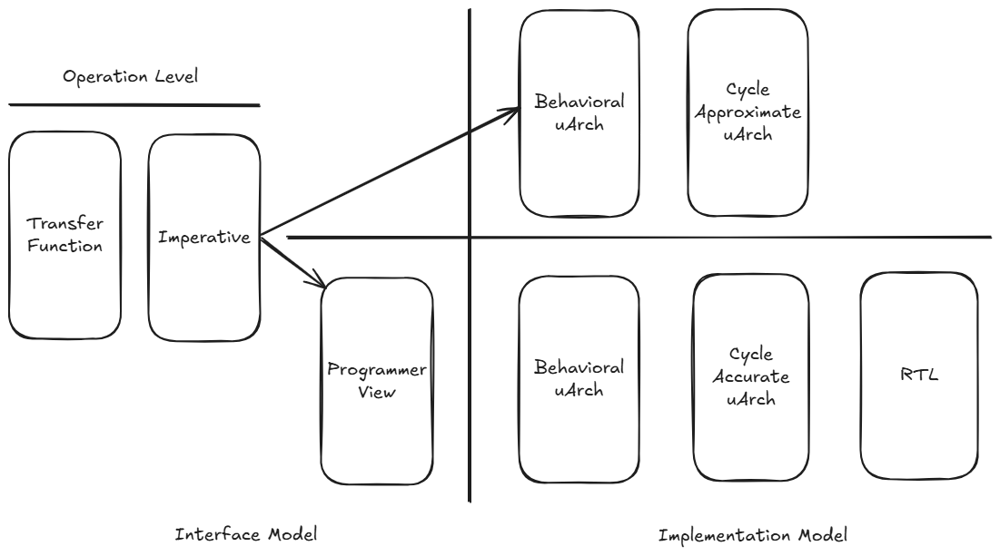

---
title: "Zuspec: Pythonic Model-Driven Hardware Development"
author: ["Matthew Ballance"]
date: "2025-09-21"
keywords: [Verilog, Hardware Modeling, PSS, Firmware, Python]
abstract: |
  Designing and implementing hardware is challenging, and is getting more 
  difficult each year as systems become more complex. Design and verification 
  teams are looking to boost productivity as a way to keep pace, 
  while also looking for ways to provide models of the design behavior to 
  software teams earlier. The fragmented and esoteric nature of the languages 
  and methodologies used for design and verification only make this more difficult. 
  Zuspec is a unified, extensible Pythonic framework for multi-abstraction 
  hardware modeling that simplifies the design and verification process and 
  enables traditional and AI-enabled automation.

...

The abstraction gap and model fragmentation are two key drivers of hardware
design-flow complexity. The abstraction difference between a 
paper design specification and the register-transfer-level (RTL) model that 
implements that specification is enormous, and only increasing as designs 
become larger and more complex. It's natural to focus attention on the 
RTL model, since that is required to get to implementation. However, RTL
models are also time-consuming to produce and execute slowly. This delays
how early software teams obtain access to a representation of the design,
and limits the platforms on which they can work to fast hardware emulation
or prototyping environments.

Creating more models at different levels of abstraction seems a good 
approach on the surface. Unfortunately, the languages and techniques
used to create these more-abstract models are fragmented, leading to
each model effectively being an independent effort. Integrating these
models into existing environments -- for example, integrating a 
C++ transaction-level model into a SystemVerilog/UVM testbench -- is
also typically labor-intensive.


Core challenges:
- Abstraction gap on hardware side, and need to increase design+verification
  productivity as designs increase in size
- Biggest challenge is the system, neither hardware nor software individually.
  - Requires working across disciplines
  - Current environments and workflows encourages hardware and software to
    carry out their work in separate silos until very late
- Need to work with other disciplines
  - Firmware
  - Emulation
  - Post-Silicon
  - 

# Approaches
Approaches:
- Increase design-creation productivity with new design languages
  and code generation (CHISEL, etc)
- New ways of constructing testbench environments (cocotb, etc)
- Harware/software co-simulation to allow co-development of 
  firmware in hardware environments
- Increase test productivity and reuse with new semantics (PSS)
- Specifications and methodologies for reuse (IP-XACT, FuseSoc)

# Considering the Ecosystem

All of these innovations primarily come from a hardware-design 
perspective, and focus on enabling hardware-design flows. That,
in itself, is a challenge given the relative sizes of the 
hardware- and software-engineering ecosystems. While it's 
difficult to find accurate detailed data, US Bureau of Labor 
Statistics reports a labor-market size of 76,800 for hardware 
engineers vs a labor-market size of 1,534,790 for software 
engineers (inclusive of all disciplines in both cases). Given 
are from the perspective have been initiated from a hardware design 
perspective, precisely because of unique semantics required to accurately 
capture the details of hardware design and verification models. This, in 
itself, is a core challenge. Since the collective challenge is the system, 
crossover is a key measure of success. Specifically, how readily can
a software discipline make use of an artifact created by a hardware 
discipline and vice versa. Motivating more than 95% percent of the
combined hardware/software ecosystem to adopt an environment tailored
to the needs of the minority seems unlikely.

# Zuspec 

Zuspec ^[https://zuspec.github.io/] targets this success criteria by 
adopting Python, an existing software language ecosystem, as its starting 
point and building hardware semantics into that ecosystem. The result is a platform
that offers high productivity for hardware engineering, as well
as an increased ability to share artifacts with software disciplines.

## Why Python?

Many factors are involved in selecting a language for any purpose: 
key language features, tool ecosystem, relevant libraries, as well
as the community around the language. Applying a language to the 
semantics of other domains raises another: flexibility of the
language. 

### Popularity is Self-Reinforcing

Python is a popular language overall, holding the top spot in many
rankings for several consecutive years, and being ranked highly 
for many years before that. Language popularity may not seem relevant
compared to the technical features of a language. Not only it is 
relevant, popularity has a direct bearing on language technical
features. TIOBE ^[https://www.tiobe.com/tiobe-index/], for example, 
measures language rank in terms of searches via a range of internet 
search engines ^[https://en.wikipedia.org/wiki/TIOBE_index]. This is, 
of course, a rough measure a the size of a language's community. Larger
communities produce more ideas for using a language and, thus,
a a larger library ecosystem. Larger communities more-rapidly
produce and refine adjacent technologies, such as code 
development and package management tools.

Popularity often builds upon itself, and there is evidence that 
AI is acting as a driver of Python's popularity.
Specifically, AI assistants are often reported to be more 
effective with Python than with other languages ^[https://www.perplexity.ai/page/ai-generates-up-to-30-of-micro-Iy6zscIfSy6miYtIqvrsMA].
This has the effect of drawing more developers to Python, which
increases the available code in Python, which more-rapidly
increases the quality of results with Python. 

But, language popularity is only relevant for the set of languages
that can be used to capture relevant domain semantics. Fortunately,
Python measures up very well here again.

### Technical Arguments for Python

There are strong technical arguments for the Python language as well.
As a dynamic language, Python provides excellent facilities for 
introspecting and manipulating a Python description. 

```python
import zuspec.dataclasses as zdc

@zdc.dataclass
class SendPacket(zdc.Struct):
  sz : zdc.Bit[8] = zdc.rand()

  @zdc.constraint
  def valid_sz(self):
    self.sz in [1, 2, 4, 8, 16]
```

Python `decorators` can be used to annotate elements of the description,
identifying specific semantics to be applied to an element or attaching
special processing instructions. For example, the `constraint` decorator
above marks the body of the `valid_sz` method as having constraint 
semantics. 

Python also allows inheritance relationships to be inspected at any
point in time. The base type controls capabilities and restrictions
of the derived type.

While Python can be used as a purely dynamically-typed language, it 
also provides the ability to associate type "hints" with variables. 
The `sz` field in the example above specifies that it is an unsigned
8-bit field. This enables the modeler to control how data in the
model will be represented in the implementation.

Finally, Python supports AST introspection and transformation. This 
capability allows tools to access the raw AST for code, such as 
the constraint method above, without needing to use tricks like 
operator overloading. 

Statically-typed languages often provide some introspection facilities
that are available during the compilation phase. In contrast, Python 
allows these facilities to be applied to a Python description at any 
point in time, providing much more flexibility in processing flows. 
Effectively, Python allows libraries like Zuspec to act as a compiler
within the Python interpreter.

Python also offers a strong set of system-programming features.
Combined with Python's dynamic language features, these dramatically
simplify the process of integrating external tools and systems.

Python also specifies a package specification and provides tools
for producing, discovering, and consuming packages.

Together, these capabilities make Python a very compelling platform 
for developing, verifying, and publishing hardware models.

# What does this look like?

All languages are a combination of syntax and semantics. Syntax 
governs the lexical aspects of a language: the keywords, operators,
and legal ways of arranging them. Semantics governs the meanings of
those statements -- for example, whether `a = b` changes the value
of the `a` variable, changes the `a` variable to reference
the `b` variable, or something entirely different. Zuspec proposes
a way to adopt full Python syntax, while identifying key regions
in which different semantics apply to this syntax. These new semantics
are always more restrictive than native Python semantics, allowing
existing code checkers (eg mypy) to work unmodified. 

Zuspec divides a Python description into two core region kinds:
- Pure Python regions
- Python regions with domain-specific semantics

In order to implement a counter in hardware, we need to be able to capture
some unique semantics:
- Bit width of the `count` field
- When the count should be incremented
- Hardware-specific notions like reset

Zuspec identifies regions with these semantics with a combination of
Python `decorators` and base classes. Let's look at the same counter 
example expressed in hardware with Zuspec.

```python
import zuspec.dataclasses as zdc

@zdc.dataclass
class Counter(zdc.Component):
  clock : zdc.Bit = zdc.input()
  reset : zdc.Bit = zdc.input()
  count : zdc.Bit[32] = zdc.output()

  @zdc.sync(clock=lambda s:s.clock, reset=lambda s:s.reset) 
  def inc(self):
    if self.reset:
      self.count = 0
    else:
      self.count += 1
```
The `Counter` example above illustrates these two regions. By default,
pure Python semantics are used. This means that the `import` statement
at the top uses pure Python semantics. 

The `Counter` class inherits from the Zuspec `Component` class, which
designates it as a class with specific capabilities.  The `inc` method
is decorated with the `sync` decorator. This marks it as a method that
is automatically evaluated on the active edge of the specified 
clock or reset signals, where the value of variables is deferred. 
It also marks it as a method that may not be invoked directly.

A class domain with special semantics is a model of implementation, 
and cannot be used directly. Instead, a `Transformer` class 
must first be used to create an implementation. The implementation 
could be pure-Python, Verilog, or something entirely different like
documentation.

```python
import asyncio
from zuspec.be.py import ComponentFactory
import zuspec.dataclasses as zdc

@zdc.dataclass
class CountTB(zdc.Component):
  clkrst : zdc.ClockReset = zdc.field(init={period=10})
  counter : Counter = zdc.field(
      bind=lambda s:{
          s.counter.clock : s.clkrst.clock,
          s.counter.reset : s.clkrst.reset
      })

def test_smoke(self):
  tb = ComponentFactory(CountTB)
  asyncio.run(tb.clkrst.do_reset(count=10))
  assert tb.counter.count == 0
  asyncio.run(tb.clkrst.wait(count=10))
  assert tb.counter.count == 10
```

The example above shows a small testbench around the `Count` 
component with a simple `Pytest` unit test. The type transformer 
creates a Python object that is used to dynamically evaluate
the model. While the interface is Python, the implementation
may not be Python. For example, the factory may transform the
model to Verilog and create a Verilator ^[https://www.veripool.org/verilator/]
simulator executable that evaluates the model much faster than
a pure-Python implementation, while still exposing a Python 
interface to the signals.


```verilog
module Counter(
    input            clock,
    input            reset,
    output reg[31:0] count);

    always @(posedge clock or posedge reset) begin
      if (reset) begin
        count <= {32{1'b0}};
      end else begin
        count <= count + 1;
      end
    end
endmodule
```

Another factory might transform the model to the synthesizable
Verilog shown above to be used as input to existing 
synthesis or simulation flows. 

# Usecases



Zuspec targets the taxonomy of models shown in the figure above. 
Interface models focus on capturing how the system view of the
component. For example, interacting with the device may be 
at the Programmer View (PV) level, using memory-mapped registers.
Implementation models focus on the device internals, implementing
the operations initiated by the interface model. 

## Transfer-Function Model

A transfer-function model represents the system impact of device
operations. Transfer-function models are high level, and are
useful for performing statistical analysis of the system impact 
of a device. For example, the transfer-function model of a DMA
copy operation is shown below.

```python
import zuspec.dataclasses as zdc

@zdc.dataclass
class Dma(zdc.Component):
    channels : ChannelR = dc.pool(count=16)

@zdc.dataclass
class Mem2Mem(zdc.Action[Dma]):
    dat_i : MemB = dc.input()
    dat_o : MemB = dc.output()
    chan : ChannelR = dc.lock()

    @zdc.constraint
    def _mem_c(self):
        self.dat_i.sz == self.dat_o.sz
```

The DMA mem-copy model above captures key aspects of the operation:
- Exclusive (lock) access to a channel is required for the duration of the operation
- A properly-initialized source-memory region (dat_i) is required for the operation
- The result of the operation is another memory region (dat_o) of the same size as the source


## Programmer-View


## Behavioral Micro-Architecture Model

```python
import zuspec.dataclasses as zdc

@zdc.dataclass
class DmaBehavioral(zdc.Component):
    regs : DmaRegs = zdc.field()

    @zdc.process
    async def _process_requests(self):

        while True:
            # Wait for an active channel
            active : bool = False
            while not active:
                for i in range(16):
                    active |= regs.channels[i].csr.read().en
            
            target_c = self._pick_channel()

            channel = self.regs.channels[i]

            # Carry out memory transfer for target channel
            # ...

```


- Key points
  - Modeling abstraction scope
  - Key features
    - System assembly at all levels
    - TLM
    - Verification
    - Generative hardware creation
  - Key derived artifacts
    - Verilog for synthesis
    - C for device drivers or management firmware
  - Key capabilities
    - Pythonic user experience -- code is central
      - Integrated engines
      - Built-in automation for build flows
    - Reuse of pre-packaged artifacts


Unique technical aspects
- Can't do this in C/C++ without creating a new compiler that 
  recognizes Union[<dialect>,C/C++]. No modular/distributed
  path to a compiler that recognizes Union[<dialect1>,<dialect2>,C/C++]


For any of these that require 

The abstraction gap between synthesiable Verilog RTL and the resulting
gates on a silicon wafer is vast. 
However, increased complexity in 
digital hardware designs provides a compelling reason to create 
even more-abstract models. 

- Left-shift the work of other teams, such as firmware teams
- To increase the simulation speeed of the system model
- Model the 'user' perspective of the design -- often used for functional verification and bringup tests.

Creating more models and raising the modeling abstraction level is 
genearlly beneficial. Unfortunately, the tools, languages, and techniques 
used for these different models are fragmented, leading to disconnected models, 
redundant work, and increased risk of bugs. In addition, disconnected models
often limit the supported types of analysis. 
EDA flows are complex, and the required flow-management scripts become 
quite complex.


Zuspec proposes a Pythonic multi-abstraction modeling framework that 
covers 
- Abstract operation-level models
- Transfer-function
- Programmer View
- TLM
- RTL 

- Verification and design
- Static/Formal and Dynamic evaluation
- Hardware and firmware

- Integrated build-flow management

# Taxonomy of Models

# Why Python?

# The Zuspec Language
Languages composted of syntax and semantics. Syntax is the way that
characters are arranged. Semantics is 
- Two parts
  - 

different models are 


